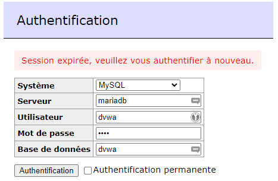
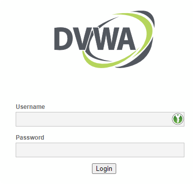
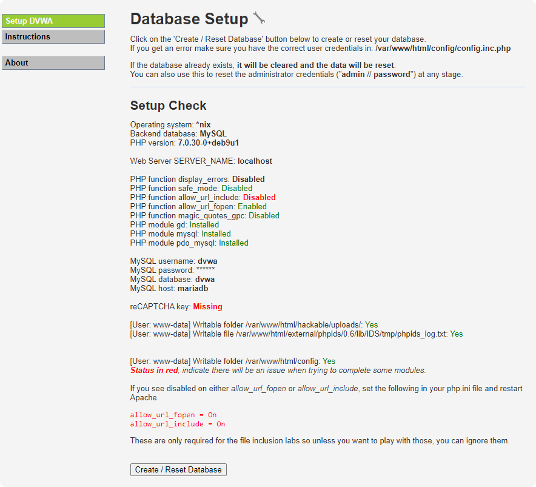
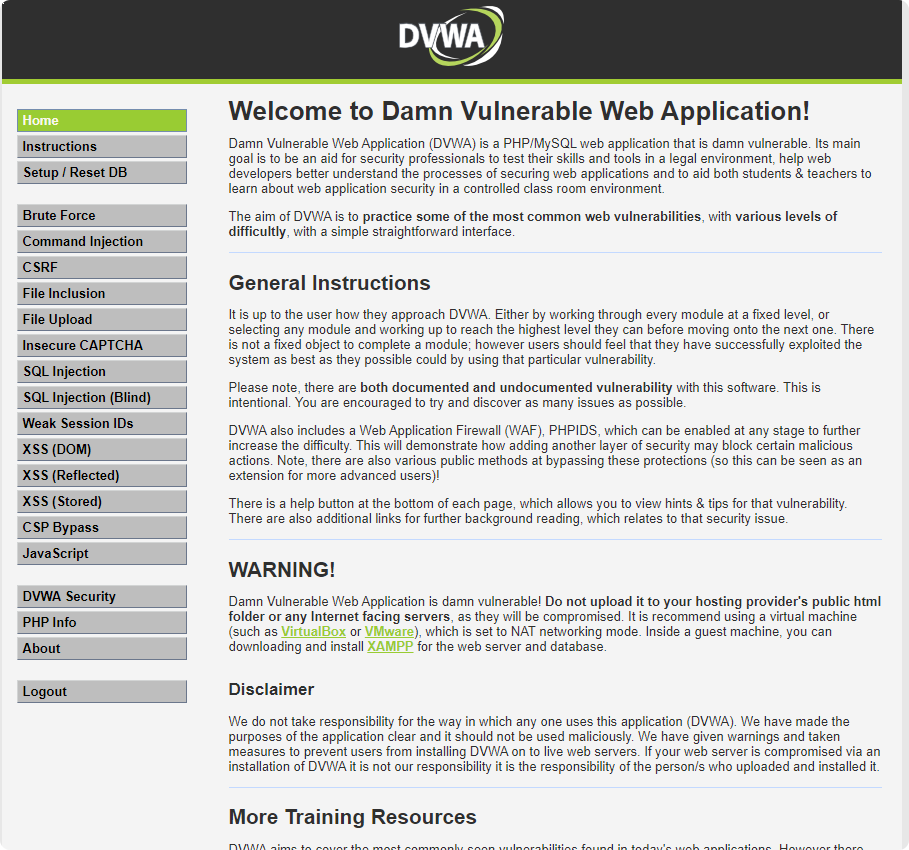
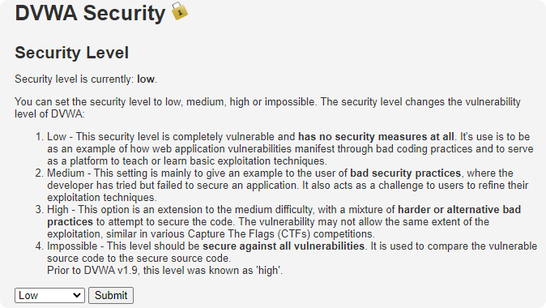

```
____             _               ______     ____        ___    
|  _ \  ___   ___| | _____ _ __  |  _ \ \   / /\ \      / / \   
| | | |/ _ \ / __| |/ / _ \ '__| | | | \ \ / /  \ \ /\ / / _ \  
| |_| | (_) | (__|   <  __/ |    | |_| |\ V /    \ V  V / ___ \
|____/ \___/ \___|_|\_\___|_|    |____/  \_/      \_/\_/_/   \_\
```
https://github.com/LiliwoL/Docker-DVWA

# Accès

DVWA:
http://localhost:80

admin:password

Adminer:
http://localhost:8080



---

# Premier lancement

Connectez vous à http://localhost



Identifiants par défaut:
L: admin
P: password

Vous allez devoir créer la base de données au premier lancement.
Toutes les informations de configuration sont déjà renseignées dans *config/config.inc.php*.



Cliquez sur **Create / Reset Database**.

Reconnectez vous avec les identifiants par défaut.

---

# Présentation

Une fois la base installée, DVWA est disponible.



---

# Sécurité

DVWA est un outil d'apprentissage de la sécurité informatique.
Vous pouvez moduler le niveau de sécurité dans la section **DVWA Security**.

